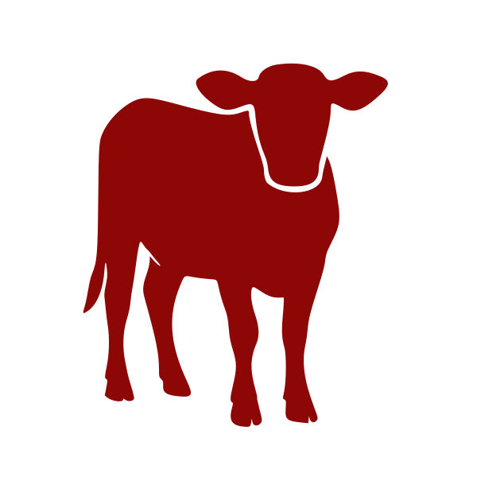

<!-- Matilda logo (top-right) -->
#  TrailForge

### Practical learning on Salesforce — introduced by Matilda, the official cow of zero-nonsense training.

> 👋 **Hi. I’m Matilda.**  
> Most “training platforms” are three hours of buzzwords followed by a quiz asking what color a button was.  
> TrailForge is different. We keep learning **short, useful, and deeply human.**  
> You’ll like it here. I promise. 🐄

---

## ✨ What Is TrailForge?

TrailForge is a **lightweight, Salesforce-native learning platform** built for teams that want:

✔ Short, focused lessons  
✔ Meaningful quizzes with training mode  
✔ Progress tracking that isn’t a black box  
✔ Optional **access-code login** for external learners  
✔ A friendly cow mascot who quietly judges corporate fluff  

If your LMS makes people roll their eyes… TrailForge will feel like a breath of fresh barn air.

---

## 🎥 See TrailForge in Action

> *(GIF placeholders — add your recordings here when ready)*

- **Access Code + Matilda’s Welcome Panel**  
  ``

- **Lesson / Slide Player**  
  ``

- **Quiz — Training Mode with Explanations**  
  ``

- **Progress Tracking**  
  ``

Matilda says: **“Show, don’t tell. Preferably in under 10 seconds.”**

---

## 🧠 Core Concepts

TrailForge content is structured like this:

**Course → Module → Lesson → Quiz → Questions → Answers**

Learners also have:

- **Enrollments**
- **Quiz Attempts**
- **Completion Status**

A full data-model walkthrough lives in:

📘 `docs/DATA-MODEL.md`

---

## 🚀 Quick Start (Developers)

```bash
# Clone the repo
git clone https://github.com/your-org/trailforge.git
cd trailforge

# Authorize an org
sf org login web --set-default -a trailforge-dev

# Deploy metadata
sf project deploy start

# Load demo content
sf data tree import -p ./data/trailforge-seed-plan.json

# Open TrailForge
sf org open

